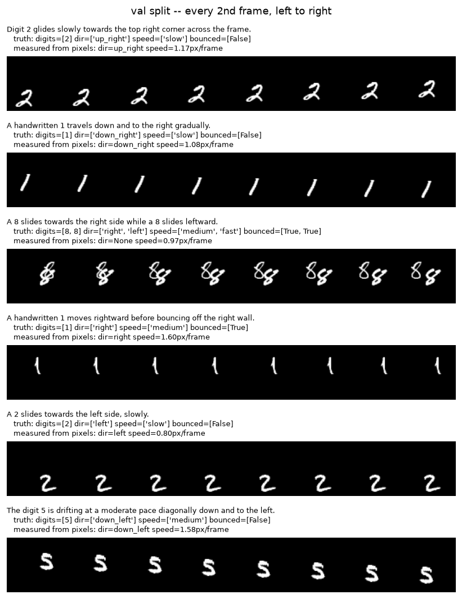

# Text-Conditioned Short Video Generation

Generate a short video clip from a natural-language sentence, using a lightweight deep
learning model trained from scratch on a single free-tier GPU.

> *"The digit 3 moves to the right."* → 16 frames of 64×64 video

The project's central question is not "can we generate video" but **does explicit
temporal modelling actually help, and by how much?** So it trains two models that are
identical in every respect except one — how the 16 frames are produced — and measures
the difference.

| | Baseline | Main model |
|---|---|---|
| Frames produced by | an MLP, independently per frame | a **ConvLSTM** carrying hidden state across frames |
| Encoder, latent, decoder, loss, seed, data, steps | identical | identical |
| Parameters | 4.27M | 6.50M |

Because everything else is held constant, any measured difference is attributable to the
recurrence.

---

## Status

The full pipeline is built, tested (110 passing tests) and verified end to end on CPU.
**GPU training has not been run yet** — the development machine has no CUDA device.
`RESULTS.md` will be populated from real runs via
[`notebooks/train_on_colab.ipynb`](notebooks/train_on_colab.ipynb).

No performance numbers are reported anywhere in this repo until they come from an actual
training run.

---

## What's in here

```
src/text2video/
  data/           Bouncing MNIST generator, caption generator, PyTorch dataset
  text_encoder/   frozen CLIP ViT-B/32 text tower + embedding cache
  models/         ConvLSTM cell, FiLM conditioning, the two VAE variants
  training/       trainer, resumable checkpointing
  evaluation/     FID, CLIPSIM, temporal consistency, structured grounding, report builder
  inference/      text prompt -> video
scripts/          CLI entry points (build data, train, evaluate, sample, report)
app/demo.py       Streamlit demo
notebooks/        Colab GPU training notebook
tests/            110 CPU-only tests
BUILD_LOG.md      decisions, tensor shapes, bugs found and fixed, measured results
```

---

## Quick start

```bash
py -3.13 -m venv .venv
.venv/Scripts/python.exe -m pip install -e ".[clip,demo,dev]"
```

```bash
python scripts/build_dataset.py --config configs/dataset.yaml
```

```bash
python scripts/build_text_embeddings.py --verify
```

```bash
python scripts/train_digit_classifier.py
```

```bash
python scripts/train.py --config configs/train_convlstm.yaml --smoke
```

For real training, use the Colab notebook — a full run is ~30–45 min per model on a T4
and impractical on CPU.

---

## The dataset

Bouncing MNIST, generated rather than downloaded: 1–2 MNIST digits move in straight
lines on a 64×64 canvas and reflect off the walls, rendered to 16 frames. Captions are
built from each clip's exact motion metadata.

| Split | Clips | Sprites from | Unique captions |
|---|---|---|---|
| train | 20,000 | MNIST train | 15,130 (75.6%) |
| val | 2,000 | MNIST test | 1,925 (96.2%) |
| test | 2,000 | MNIST test | 1,931 (96.5%) |

Train and val/test draw from **disjoint MNIST image pools**, so evaluation tests
generalisation to unseen handwriting rather than memorisation.

**Why generate it?** Because we then know the ground truth exactly — which digit, which
direction, what speed, whether it bounced. That is what makes it possible to check
whether a *generated* clip actually did what the caption asked, instead of only asking
whether it looks plausible. Most portfolio projects cannot do this.

Captions mix 17 templates with synonym banks for verbs, speeds and direction phrasings,
so the model must generalise over wording:

> *"A handwritten 2 slides towards the top right corner before bouncing off the right wall."*
> *"Two digits, 1 and 6, slide at a slow pace."*
> *"The digit 5 is drifting at a moderate pace diagonally down and to the left."*



Regenerate this preview any time with `python scripts/inspect_dataset.py --split val`.

---

## The model

```
Caption ──> frozen CLIP ViT-B/32 ──> 512-d embedding
                                          │
              Video ──> CNN+GRU encoder ──┴──> posterior q(z | video, text)
                                          │           learned prior p(z | text)
                                          ▼
                            ConvLSTM decoder, stepped 16 times
                              (hidden state carries motion forward)
                                          │
                                          ▼
                               16 × 64×64 generated frames
```

**Frozen CLIP text encoder.** Training a language model is not the point, so the text
tower is frozen and its embeddings are cached before training — CLIP never runs inside
the training loop.

**Conditional VAE.** One caption legitimately matches many videos (any handwriting, any
starting position). A deterministic model trained on MSE would average them into a blur.
The VAE learns a distribution, and generation samples a latent from a **text-conditioned
prior** — so generation needs no video input at all.

**ConvLSTM.** An ordinary LSTM flattens its input, destroying spatial layout. A ConvLSTM
replaces the gate matrix-multiplies with convolutions, so its hidden and cell states stay
(channels, 4, 4) feature maps. "The digit is here and moving right" is a spatial fact,
and the cell state carries it across timesteps. This is the experimental variable.

---

## Evaluation

Five axes, on a held-out test split with a fixed sampling seed.

| Axis | Metric |
|---|---|
| Visual quality | FID over CLIP image features |
| Text alignment | CLIPSIM, plus a measured discrimination check |
| Temporal consistency | frame SSIM **paired with** optical-flow motion magnitude |
| Semantic correctness | **structured grounding** — right digit, right direction, right speed |
| Cost | parameters, training time, inference time per clip |

Two reference rows are evaluated alongside the models:

**Real-data ceiling.** The same metrics on ground-truth clips. Measurement is imperfect —
direction recovery tops out at 94.7% even on real video — so generated scores are read
against what is achievable, not against 100%.

| digit | direction | speed | grounding | frame SSIM | motion |
|---|---|---|---|---|---|
| 99.2% | 94.7% | 88.6% | 94.2% | 0.890 | 1.50 px/frame |

**Static control.** Frame 0 repeated 16 times. It generates no motion whatsoever, and
scores a **perfect 1.0000 frame SSIM** — it would top a naive leaderboard:

| frame SSIM | motion | temporal score | direction |
|---|---|---|---|
| **1.0000** | 0.00 | **0.0000** | 0.0% |

That is exactly why frame similarity is never reported on its own here. Every similarity
number is paired with evidence that motion actually happened.

### Why structured grounding is the primary alignment metric

A linear probe on the frozen CLIP embeddings recovers **direction at 93.0%** and **digit
identity at 99.6%** — the information is clearly there, and conditioning can work.

But the cosine similarity between *"The digit 3 moves to the right."* and *"The digit 3
moves to the **left**."* is **0.98**. The directional signal lives in a low-variance
subspace that whole-vector cosine similarity does not surface — and CLIPSIM *is*
whole-vector cosine similarity.

So CLIPSIM is reported for comparability, while grounding — an independently trained
MNIST CNN plus optical measurement, with **no CLIP in the loop** — is what the
conclusions rest on.

---

## Demo

```bash
streamlit run app/demo.py
```

Type a sentence, get a generated clip plus an honest scorecard: which digit actually
appeared, which direction it actually moved, and whether it moved at all.

---

## GPU training

The development machine has no CUDA device, so training runs on a free cloud GPU.

| Notebook | Platform |
|---|---|
| [`notebooks/train_on_kaggle.ipynb`](notebooks/train_on_kaggle.ipynb) | Kaggle (primary) |
| [`notebooks/train_on_colab.ipynb`](notebooks/train_on_colab.ipynb) | Google Colab |

Both run top to bottom in roughly 1.5–2 hours for both models plus evaluation. Setup and
sanity checks are separated from long training by an explicit banner, so the cheap checks
can be run and inspected first.

The dataset is regenerated in the session rather than uploaded — it is fully deterministic
from the seeds in `configs/dataset.yaml`, and 1.5 GB is not worth uploading when the code
is a few hundred KB.

Free sessions disconnect without warning, so checkpoints carry model **and** optimizer
**and** scheduler **and** RNG state, are saved on both a step interval and a wall-clock
timer, and are mirrored via `--mirror-dir`. Re-running a training cell with
`--resume auto` continues exactly where it stopped.

On Kaggle specifically, the project is installed with `pip install --no-deps -e .` — a
plain install lets pip resolve `torch` and silently replace Kaggle's CUDA build with a CPU
wheel, which would run training at CPU speed on a GPU machine. The notebook asserts
`torch.cuda.is_available()` after installing to catch exactly that.

---

## Tests

```bash
python -m pytest tests/ -q
```

110 tests, CPU-only, no network access, a few seconds to run. The ones that matter most:

- `test_rendered_motion_matches_direction_label` — the video really does what its label says
- `test_bounce_is_only_mentioned_when_it_happens` — captions are never false
- `test_static_video_scores_perfect_ssim` — pins the metric trap the design guards against
- `test_temporal_score_rejects_the_static_control` — and confirms the guard works
- `test_static_clips_score_zero_speed` — "did not move" must not count as "moved slowly"
- `test_overfits_two_real_clips` — the gate before any GPU time is spent
- `test_optimizer_state_is_preserved` — resuming must not silently reset Adam's momentum

---

## Scope

Deliberately **not** included: GAN and diffusion variants, real-world video datasets,
high resolution, long clips. The goal is one model that demonstrably works, a controlled
comparison that isolates a single variable, and honest measurement — not an architecture
survey.

See [`PROJECT_OVERVIEW.md`](PROJECT_OVERVIEW.md) for the full scope and
[`BUILD_LOG.md`](BUILD_LOG.md) for decisions, tensor shapes, and the bugs found along the
way.
